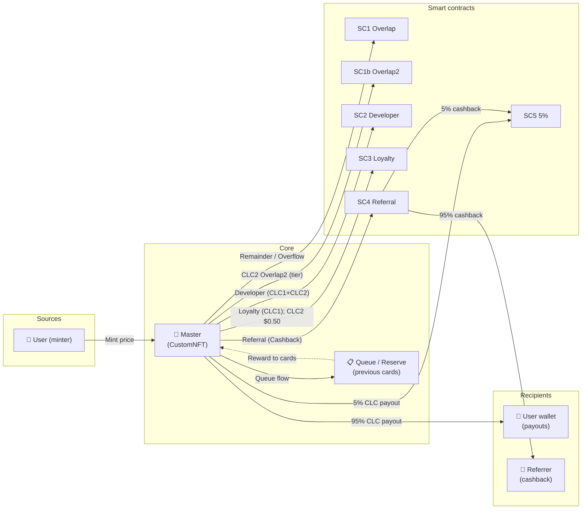
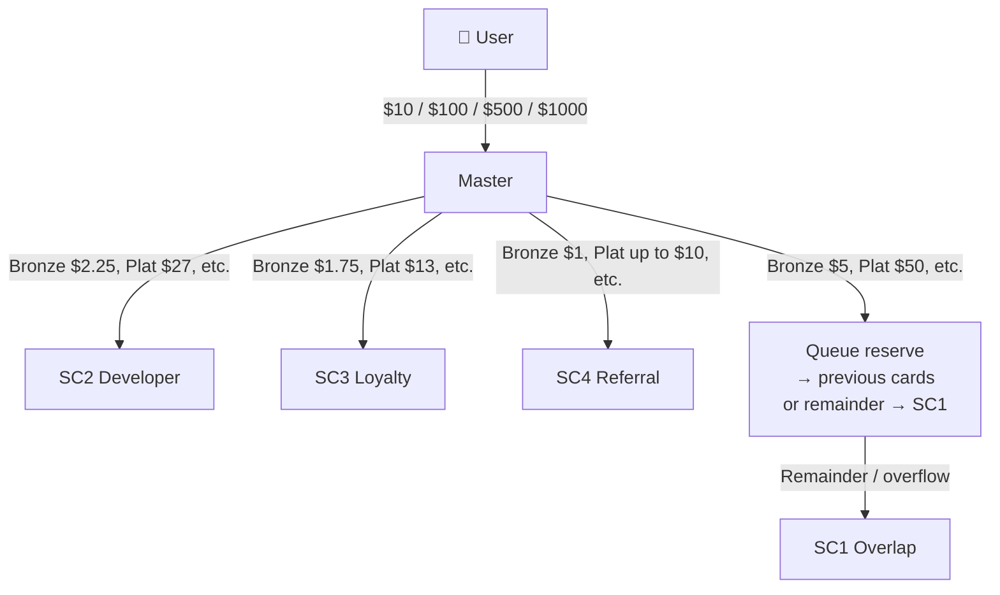
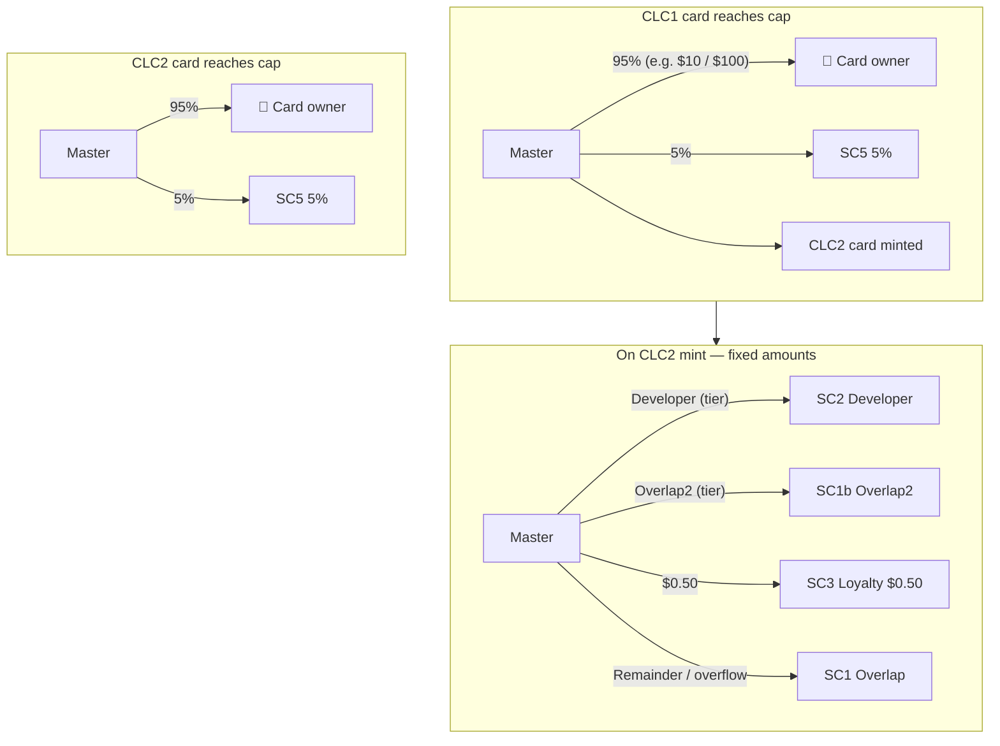
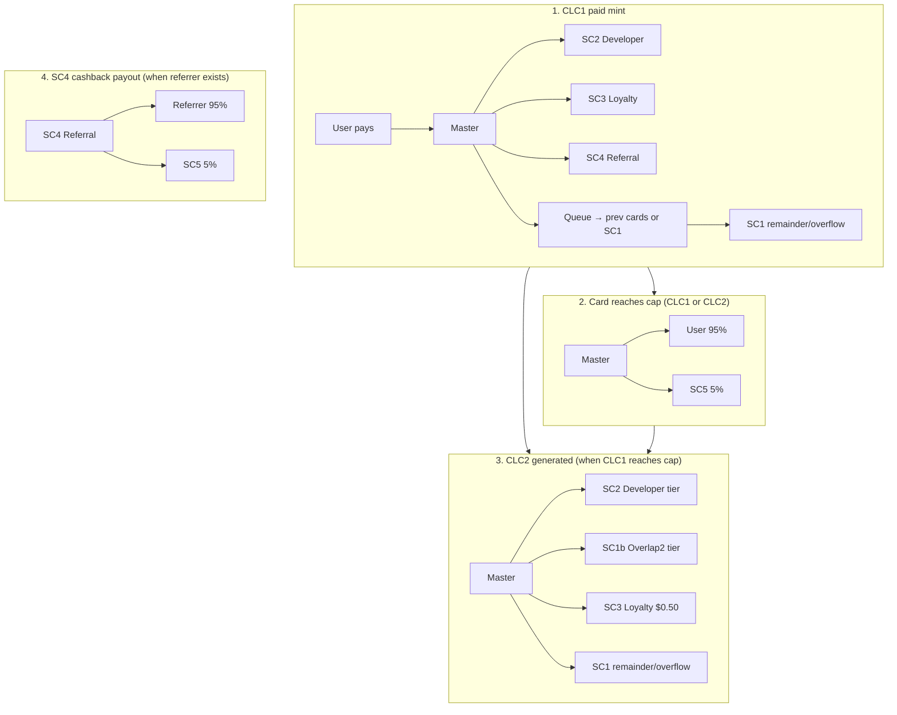

# Main Flow & Cash Flow — All Cards

This document describes the **main user and system flow** and the **cash flow** (where USDT goes) for each card tier on mint.

---

## Part 1 — Main flow

### 1.1 User journey (high level)

1. **Connect wallet**  
   User connects a Web3 wallet (e.g. MetaMask) and switches to the correct network (e.g. BSC Testnet).

2. **Optional: set referrer**  
   If the user has a referral link (`?ref=0x...`), the referrer is set once (on first mint). The referrer will earn Cards Cashback when this user mints.

3. **Mint a card**  
   User chooses a tier (Bronze, Platinum, Emerald, or Diamond), optionally enters quantity (1–99), approves USDT and confirms. The contract pulls the tier price × quantity and mints that many cards. Each mint triggers the cash flow below.

4. **Card in queue**  
   Each minted card joins the global queue. New mints send a “queue amount” into the contract; that is distributed to the **oldest previous cards** (up to 1 or 5 cards depending on tier). Cards’ reward balances grow until they reach their CLC cap.

5. **CLC1 → cap reached**  
   When a card’s reward balance reaches its **CLC1 cap**, the contract:
   - Pays out the first part to the owner’s wallet (95% user, 5% to the 5% SC).
   - Uses the second part to **auto-mint a CLC2 card** for the same owner (same tier; that card is “withdraw only”, no second cycle).

6. **CLC2 → cap reached**  
   When the CLC2 card’s reward balance reaches its **CLC2 cap**, the contract pays out to the owner’s wallet (95% / 5% split again), then the card is **dismissed** (no more rewards).

7. **Withdraw (optional)**  
   If a card is complete and there is remaining balance (e.g. final chunk not yet sent), the owner can call **Withdraw** to receive it. After that, the card shows as Withdrawn or Dismissed.

8. **Points & history**  
   - **Loyalty & Level points** are credited in SC3 when the user mints (CLC1 only; CLC2 does not add points).  
   - **Cards Cashback history** shows the full condition-based cashback recorded when referrals mint (credited to the referrer’s card queue on-chain, or retained in SC4 if they had no NFT).

---

### 1.2 System flow (what happens on each paid mint)

```
User approves USDT → mintWithPayment(to, referrer, tier)
  │
  ├─ Pull tier price from user (e.g. $10 / $100 / $500 / $1000)
  │
  ├─ Split (see Part 2):
  │    • Developer (SC2)     — fixed $ per tier
  │    • Loyalty & Level (SC3) — fixed $ per tier
  │    • Cards Cashback (SC4)  — depends on referrer condition (1–4) and tier
  │    • Queue amount         — into contract reserve, then:
  │         – First mint ever: part to Overlap (SC1), rest to reserve
  │         – Later mints: distribute to up to 1 or 5 previous cards (oldest first)
  │                         per card = minting tier’s rewardToPrev; overflow → SC1
  │
  ├─ New card minted (tokenId), reward balance may get “self” share from queue
  │
  └─ If any previous card reached cap during this distribution:
       → Payout to that card’s owner (95% / 5%)
       → If CLC1: optionally auto-mint CLC2 for owner (from reserve)
       → On CLC2 mint: flow in row queue (see 3.4) + 95% of flow to SC1b + 5% of flow to POINTS SC (SC3)
```

---

### 1.3 Card life cycle (CLC) in one diagram

```
[User mints] → CLC1 card created
                    ↓
              Reward balance grows (from later mints’ queue distribution)
                    ↓
              Balance reaches CLC1 cap
                    ↓
              Payout to wallet (95% user, 5% SC5) + CLC2 card auto-minted
                    ↓
              CLC2 card reward balance grows
                    ↓
              Balance reaches CLC2 cap
                    ↓
              Payout to wallet (95% user, 5% SC5) → card dismissed
```

---

## Part 2 — Cash flow for all cards

Every **paid mint** splits the tier price as below. Amounts are in **USDT per card** (one mint of that tier).

**Cards Cashback** is variable: it depends on the **referrer’s qualification condition** (1–4). See [CARDS_CASHBACK_SPEC.md](CARDS_CASHBACK_SPEC.md) for the exact table. The figures in the “Cards Cashback” column below are the **maximum** (Condition 4); lower conditions give smaller amounts.

**First mint in the system:** For the very first card ever minted, the “Queue” column amount is not fully distributed (there are no previous cards). The **first-mint overlap** in the last column is sent to **SC1 OverlapReceiver** instead; the rest stays in contract reserve for future queue payouts.

---

### 2.0 Cashflow summary by card (CLC1 and CLC2)

For each tier, cashflow is split into **CLC1** (when the user mints a paid card) and **CLC2** (when a CLC2 card is auto-generated after a CLC1 card reaches cap). CLC2 uses **fixed amounts** per tier: Developer & Team (SC2), OverlapReceiver2 (SC1b), and SC3 Loyalty ($0.5 for all tiers).

**Bronze card ($10)**  
| Phase | Cash in flow to queue | Referral Fee | Loyalty (SC3) | Developer & Team (SC2) | OverlapReceiver2 (SC1b) |
|-------|------------------------|--------------|---------------|--------------------------|--------------------------|
| **CLC1** | $5 | $1 | $1.75 | $2.25 | — |
| **CLC2** | $5 | — | $0.50 | $2.25 | $2.25 |

**Platinum card ($100)**  
| Phase | Cash in flow to queue | Referral Fee | Loyalty (SC3) | Developer & Team (SC2) | OverlapReceiver2 (SC1b) |
|-------|------------------------|--------------|---------------|--------------------------|--------------------------|
| **CLC1** | $50 | $10 | $13 | $27 | — |
| **CLC2** | $50 | — | $0.50 | $27 | $22.50 |

**Emerald card ($500)**  
| Phase | Cash in flow to queue | Referral Fee | Loyalty (SC3) | Developer & Team (SC2) | OverlapReceiver2 (SC1b) |
|-------|------------------------|--------------|---------------|--------------------------|--------------------------|
| **CLC1** | $250 | $50 | $63 | $137 | — |
| **CLC2** | $250 | — | $0.50 | $137 | $112.50 |

**Diamond card ($1000)**  
| Phase | Cash in flow to queue | Referral Fee | Loyalty (SC3) | Developer & Team (SC2) | OverlapReceiver2 (SC1b) |
|-------|------------------------|--------------|---------------|--------------------------|--------------------------|
| **CLC1** | $500 | $100 | $125.5 | $274.5 | — |
| **CLC2** | $500 | — | $0.50 | $274.5 | $225 |

- **CLC1:** Queue flow is distributed to previous cards (oldest first); remainder/overflow → SC1 OverlapReceiver. Referral Fee goes to SC4; when a referrer exists, SC4 pays 95% to referrer and 5% to SC5.
- **CLC2:** Queue flow is distributed to previous cards; then **fixed amounts** go to **Developer & Team (SC2)**, **OverlapReceiver2 (SC1b)**, and **SC3 Loyalty ($0.50)**. Any queue remainder (unallocated + overflow) goes to SC1 OverlapReceiver.

---

### 2.1 Bronze — $10 per card

| Destination        | Amount (USDT) | Note |
|--------------------|---------------|------|
| **Queue**          | $5            | Distributed to **1** previous card (oldest), $5 each; overflow → SC1 |
| **Cards Cashback** | $1            | Sent to SC4; when paid out: 95% referrer, 5% SC5 |
| **Loyalty & Level** | $1.75         | To SC3 (LoyaltyLevelVault) |
| **Developer**      | $2.25         | To SC2 (DeveloperReceiver) |
| **First-mint overlap** | $5         | Only when no cards exist yet; goes to SC1 |

**CLC:** CLC1 cap $20 ($10 to wallet, $10 to mint CLC2). CLC2 cap $10 ($10 to wallet, then dismissed).

---

### 2.2 Platinum — $100 per card

| Destination        | Amount (USDT) | Note |
|--------------------|---------------|------|
| **Queue**          | $50           | Distributed to **5** previous cards (oldest first), $10 each; overflow → SC1 |
| **Cards Cashback** | $1–$10        | Depends on referrer condition; sent to SC4, then 95% referrer / 5% SC5 on payout |
| **Loyalty & Level** | $13          | To SC3 |
| **Developer**      | $27           | To SC2 |
| **First-mint overlap** | $10       | Only when no cards exist yet; goes to SC1 |

**CLC:** CLC1 cap $200 ($100 to wallet, $100 to mint CLC2). CLC2 cap $100 ($100 to wallet, then dismissed).

---

### 2.3 Emerald — $500 per card

| Destination        | Amount (USDT) | Note |
|--------------------|---------------|------|
| **Queue**          | $250          | Distributed to **5** previous cards, $50 each; overflow → SC1 |
| **Cards Cashback** | $1–$50        | Depends on referrer condition; sent to SC4, then 95% referrer / 5% SC5 on payout |
| **Loyalty & Level** | $63          | To SC3 |
| **Developer**      | $137          | To SC2 |
| **First-mint overlap** | $250      | 5×$50 when no cards exist yet; goes to SC1 |

**CLC:** CLC1 cap $1125 ($625 to wallet, $500 to mint CLC2). CLC2 cap $625 ($625 to wallet, then dismissed).

---

### 2.4 Diamond — $1000 per card

| Destination        | Amount (USDT) | Note |
|--------------------|---------------|------|
| **Queue**          | $500          | Distributed to **5** previous cards, $100 each; overflow → SC1 |
| **Cards Cashback** | $1–$100       | Depends on referrer condition; sent to SC4, then 95% referrer / 5% SC5 on payout |
| **Loyalty & Level** | $125.5       | To SC3 |
| **Developer**      | $274.5        | To SC2 |
| **First-mint overlap** | $500     | 5×$100 when no cards exist yet; goes to SC1 |

**CLC:** CLC1 cap $2500 ($1500 to wallet, $1000 to mint CLC2). CLC2 cap $1500 ($1500 to wallet, then dismissed).

---

### 2.5 Gift card — $0 (admin only; recipient must have never minted)

Gift cards are **not paid by the user**. An admin sends a gift card to a wallet that has **never minted any card** (contract enforces `balanceOf(to) == 0`). The gift card uses the same queue flow as other cards (receives from later mints); when caps are reached, payouts go to **Gift Card SC**, **SC3**, and **SC1** instead of the user.

**Eligibility:** Only wallets with **zero** cards can receive a gift card. The admin page checks eligibility and the contract reverts if the recipient already owns any card.

**Referrer condition:** A gift card user is treated as **Condition D** (level 4) for **Cards Cashback amounts** (the USDT slice sent via SC4). **Queue** and **Cards Cashback** settle on Gift CLC1 like **Diamond CLC1** from the first qualifying mint (no locked phase). See [GIFT_CARD_AND_RAFFLE_COUPON.md](GIFT_CARD_AND_RAFFLE_COUPON.md).

**Three referred Diamonds (Master, on-chain):** Each paid **Diamond CLC1** mint by a user whose on-chain referrer is the **gift card owner** increments **`referralDiamondMintCountForUpline[giftOwner]`** up to **3**. This counter **only** gates **Gift Card SC** user payouts ([GIFT_CARD_AND_RAFFLE_COUPON.md](GIFT_CARD_AND_RAFFLE_COUPON.md) §1.8). At **3**, Master emits **`GiftReferralDiamondCountReached`**.

**CLC1 ($0 user payment; CLC1 reward cap $2500** nominal in default tier config):**

| When CLC1 cap is reached | Destination | Amount (USDT) |
|--------------------------|-------------|---------------|
| Gift Card SC             | $1000       | |
| SC3 Loyalty (POINTS)     | $126        | |
| SC1 Overlap              | $374        | |
| CLC2 mint                | $1000       | (auto-mint CLC2 card for same owner) |

**CLC2 (gift CLC2; cap $1000):** Same queue/developer/overlap flow as a normal Diamond CLC2 when the gift CLC2 card is **generated** (Developer SC2 $274.5, SC1b $225, SC3 $0.50; queue remainder → SC1). When the **gift CLC2 card is generated**, an additional **$500** goes to **SC1 Overlap**. When the gift CLC2 card **reaches cap** ($1000), **$1000** goes to **Gift Card SC** (no user payout).

| Phase | Gift Card SC | SC3 | SC1 Overlap | CLC2 / SC2 / SC1b |
|-------|--------------|-----|-------------|--------------------|
| **Gift CLC1 cap** | $1000 | $126 | $374 | $1000 to mint CLC2 |
| **Gift CLC2 generated** | — | $0.50 | $500 (+ queue remainder) | SC2 $274.5, SC1b $225 |
| **Gift CLC2 cap** | $1000 | — | — | — |

**$1000 + $1000 user payouts (Gift Card SC):** Owner calls **`payoutGiftClc1Bonus`** / **`payoutGiftClc2Bonus`** when **`referralDiamondMintCountForUpline(giftCardUser) >= 3`** and Master has recorded **`onGiftCLC1CapReached`** / **`onGiftCLC2CapReached`** for that user. **Legacy:** **`payoutBothConditionsMet`** still sends **$2000** in one transfer for older deployments when appropriate. Details: [GIFT_CARD_AND_RAFFLE_COUPON.md](GIFT_CARD_AND_RAFFLE_COUPON.md) §1.8.

---

## Part 3 — Summary tables

### 3.1 Fixed amounts per tier (USDT per mint)

| Tier     | Price | Queue | Loyalty & Level (SC3) | Developer (SC2) | Flow to previous cards |
|----------|-------|-------|------------------------|-----------------|-------------------------|
| Bronze   | $10   | $5    | $1.75                  | $2.25           | $5 × 1 card             |
| Platinum | $100  | $50   | $13                    | $27             | $10 × 5 cards           |
| Emerald  | $500  | $250  | $63                    | $137            | $50 × 5 cards           |
| Diamond  | $1000 | $500  | $125.5                 | $274.5          | $100 × 5 cards          |

### 3.2 CLC caps and payouts (USDT)

| Tier     | CLC1 cap | CLC1 → wallet | CLC1 → CLC2 mint | CLC2 cap | CLC2 → wallet |
|----------|----------|---------------|-------------------|----------|----------------|
| Bronze   | $20      | $10           | $10               | $10      | $10            |
| Platinum | $200     | $100          | $100              | $100     | $100           |
| Emerald  | $1125    | $625          | $500              | $625     | $625           |
| Diamond  | $2500    | $1500         | $1000             | $1500    | $1500          |

### 3.2a When CLC1 completes and CLC2 is generated (per tier)

**CLC1 card “completes”** when its **reward balance from the queue reaches the CLC1 cap**. At that moment the card stops receiving queue rewards (it is marked complete), the contract pays out the wallet share (95% user, 5% SC5), and **a CLC2 card is generated** for the same owner and tier. So “CLC1 dismissed” and “CLC2 generated” happen in the **same event**.

| Tier     | When CLC1 completes (reward balance reaches) | What happens then | When CLC2 is generated |
|----------|----------------------------------------------|-------------------|--------------------------|
| **Bronze**   | **$20** (CLC1 cap) | $10 to owner’s wallet (95% / 5% split), $10 used to mint CLC2. CLC1 card no longer receives queue rewards. | **At the same time** — CLC2 Bronze card is auto-minted for the owner. |
| **Platinum** | **$200** (CLC1 cap) | $100 to wallet, $100 to mint CLC2. CLC1 card no longer receives queue rewards. | **At the same time** — CLC2 Platinum card is auto-minted. |
| **Emerald**  | **$1125** (CLC1 cap) | $625 to wallet, $500 to mint CLC2. CLC1 card no longer receives queue rewards. | **At the same time** — CLC2 Emerald card is auto-minted. |
| **Diamond**  | **$2500** (CLC1 cap) | $1500 to wallet, $1000 to mint CLC2. CLC1 card no longer receives queue rewards. | **At the same time** — CLC2 Diamond card is auto-minted. |

**When is CLC2 dismissed?**  
The **CLC2 card** is **dismissed** when its reward balance reaches the **CLC2 cap**. Then the contract pays out to the owner (95% / 5%) and the card is marked dismissed (no more rewards).

| Tier     | When CLC2 is dismissed (reward balance reaches) | What happens then |
|----------|-------------------------------------------------|-------------------|
| **Bronze**   | **$10** (CLC2 cap)  | $10 to wallet (95% / 5%); card dismissed. |
| **Platinum** | **$100** (CLC2 cap) | $100 to wallet; card dismissed. |
| **Emerald**  | **$625** (CLC2 cap) | $625 to wallet; card dismissed. |
| **Diamond**  | **$1500** (CLC2 cap) | $1500 to wallet; card dismissed. |

Summary: **CLC1 completes and CLC2 is generated** in a single step when the CLC1 card’s queue reward balance hits the tier’s CLC1 cap. **CLC2 is dismissed** when its queue reward balance hits the tier’s CLC2 cap.

### 3.3 SC1 Overlap — remainder USDT from main card flow

**Overlap SC1** is the contract that receives **remainder USDT** from the main card flow in queue. The queue amount per mint (per tier) is:

| Tier     | Queue amount (USDT) |
|----------|----------------------|
| Bronze   | $5                   |
| Platinum | $50 (5×$10)          |
| Emerald  | $250 (5×$50)         |
| Diamond  | $500 (5×$100)        |

SC1 receives this queue money in exactly **two cases** (for both CLC1 and CLC2 mints):

1. **No cards in queue** — When there are no (or not enough) previous cards to receive the flow, the full queue amount (or the unallocated part) goes to SC1.  
   - First mint ever: the first-mint overlap (e.g. Bronze $5, Platinum $50) goes to SC1.  
   - Any mint where the queue is not fully absorbed: the remainder goes to SC1.

2. **Remainder after distribution** — After cards in the queue receive their share per the flow rule, any **remaining** USDT (unallocated queue + overflow from cards already at cap) goes to SC1.

**All** remainder payment after cards in the queue receive rewards goes to **SC1 OverlapReceiver**.

### 3.4 First-mint overlap (when no cards exist)

| Tier     | Amount to SC1 Overlap |
|----------|------------------------|
| Bronze   | $5                     |
| Platinum | $50 (5×$10)            |
| Emerald  | $250 (5×$50)           |
| Diamond  | $500 (5×$100)          |

### 3.5 When a CLC2 card is generated (fixed amounts)

When a CLC1 card reaches cap and a **CLC2 card is auto-minted**, the CLC2 cashflow is:

1. **Cash in flow to queue** — Same amount as CLC1 ($5 / $50 / $250 / $500). Distributed to previous cards (oldest first); any remainder or overflow goes to **SC1 OverlapReceiver**.
2. **Developer & Team profit (SC2)** — Fixed amount per tier (same as CLC1 developer amount).
3. **OverlapReceiver2 (SC1b)** — Fixed amount per tier.
4. **SC3 Loyalty** — **$0.50** for all tiers.

| Tier     | Cash in flow to queue | Developer & Team (SC2) | OverlapReceiver2 (SC1b) | SC3 Loyalty |
|----------|------------------------|------------------------|--------------------------|-------------|
| Bronze   | $5                     | $2.25                  | $2.25                    | $0.50       |
| Platinum | $50                    | $27                    | $22.50                   | $0.50       |
| Emerald  | $250                   | $137                   | $112.50                  | $0.50       |
| Diamond  | $500                   | $274.50                | $225                     | $0.50       |

- **OverlapReceiver2** is used only for CLC2: it receives the fixed amount above when a CLC2 card is generated. It does not receive first-mint overlap or queue remainder (those go to SC1).
- **Remainder to SC1:** Any queue amount not applied to previous cards (unallocated + overflow) goes to **SC1 OverlapReceiver** (see §3.3).

---

## Part 4 — Cashflow diagrams (all USDT flows)

The following diagrams show **all USDT flows** between the user, cards, and smart contracts (SCs). Amounts are per-tier; see Part 2 and Part 3 for exact figures.

### 4.1 Overview: all parties and flows



### 4.2 CLC1 paid mint — where the tier price goes

When a user mints a card (CLC1), the full tier price is split as below. “Queue” is then distributed to previous cards or sent to SC1 as remainder/overflow.



### 4.3 Card reaches cap — payout and CLC2 generation

When a **CLC1** card’s reward balance reaches the CLC1 cap, the contract pays the owner and may auto-mint a CLC2 card. When a **CLC2** card reaches the CLC2 cap, the contract pays the owner and dismisses the card.



### 4.4 Full cashflow by phase (all cards and SCs)

Single diagram summarizing **all USDT flows** by phase: CLC1 mint, queue/overlap, CLC payout, CLC2 generation, and SC4 cashback.



**Legend**
- **Queue → prev cards or SC1:** Queue amount is distributed to the oldest previous cards (1 or 5 by tier); any unallocated amount or overflow goes to SC1.
- **SC1:** Receives first-mint overlap (when no cards exist) and all queue remainder/overflow on both CLC1 and CLC2 mints.
- **SC1b:** Receives only when a CLC2 card is generated: fixed amount per tier (Bronze $2.25, Platinum $22.50, Emerald $112.50, Diamond $225).
- **SC2:** Receives developer amount on every CLC1 mint and on every CLC2 generation (same fixed amount per tier).
- **SC3:** Receives loyalty amount on CLC1 mint; on CLC2 generation receives $0.50 (all tiers).
- **SC5:** Receives 5% of CLC payouts from Master and 5% of cashback payouts from SC4.

---

## Part 5 — Contract roles (cash flow)

| Contract / destination | Role in cash flow |
|------------------------|-------------------|
| **User wallet**        | Pays tier price on mint; receives 95% of CLC payouts and of Cards Cashback (when they are the referrer). |
| **CustomNFT (Master)** | Holds queue reserve; distributes to previous cards; performs CLC payouts and CLC2 mint; sends shares to SC1, SC1b, SC2, SC3, SC4. |
| **SC1 OverlapReceiver** | Receives all remainder USDT from the main card flow in queue: (1) when there are no cards in queue (or not enough to absorb the flow), and (2) when some USDT remains after queue cards receive their rewards (unallocated + overflow). Applies to both CLC1 and CLC2 mints. |
| **SC1b OverlapReceiver2** | Receives a fixed amount when a CLC2 card is generated: Bronze $2.25, Platinum $22.50, Emerald $112.50, Diamond $225. All queue remainder goes to SC1 (see §3.3). |
| **SC2 DeveloperReceiver** | Receives the fixed developer/team profit amount on every CLC1 paid mint and on every CLC2 card generation (same amount per tier). |
| **SC5 FivePercentReceiver (5% SC)** | Receives only the 5% part of payments sent to user wallets: 5% of CLC payouts from Master and 5% of cashback payouts from SC4. |
| **SC3 LoyaltyLevelVault** | Receives loyalty/level amount per CLC1 paid mint; receives **$0.50** per CLC2 card generated (all tiers); holds USDT; credits points. |
| **SC4 ReferralFeeHandler** | Receives Cards Cashback amount on every paid mint. If a referrer exists, SC4 sends 95% to the referrer and 5% to SC5. If no referrer exists, the cashback amount stays in SC4. |
