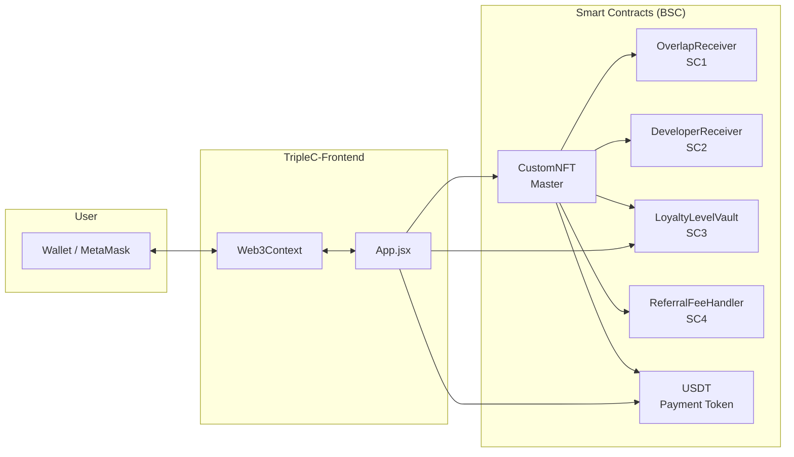
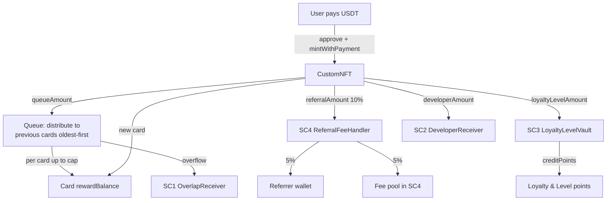
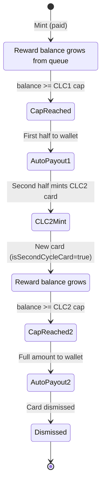
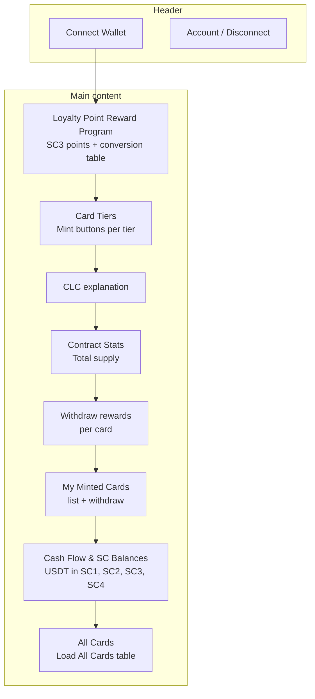

# Triple C — System & Cash Flow Diagram

Render the Mermaid diagrams below in GitHub, VS Code (Markdown Preview Mermaid), or [mermaid.live](https://mermaid.live).

---

## High-level architecture

---

## Cash flow on mint (paid mint)

---

## Card life cycle (CLC)

---

## Frontend sections (what the UI does)

---

## Contract roles (one-liner)

| Contract | Role |
|----------|------|
| **CustomNFT** | Mint cards; split USDT to queue/SC1–SC4; distribute to previous cards; CLC auto-payout and CLC2 auto-mint. |
| **SC1 OverlapReceiver** | Hold queue overflow USDT; owner withdraws. |
| **SC2 DeveloperReceiver** | Hold developer share USDT; owner withdraws. |
| **SC3 LoyaltyLevelVault** | Hold loyalty/level USDT; Master credits points per user. |
| **SC4 ReferralFeeHandler** | Receive 10%; send 5% to referrer, 5% to fee pool; owner withdraws fee pool. |
