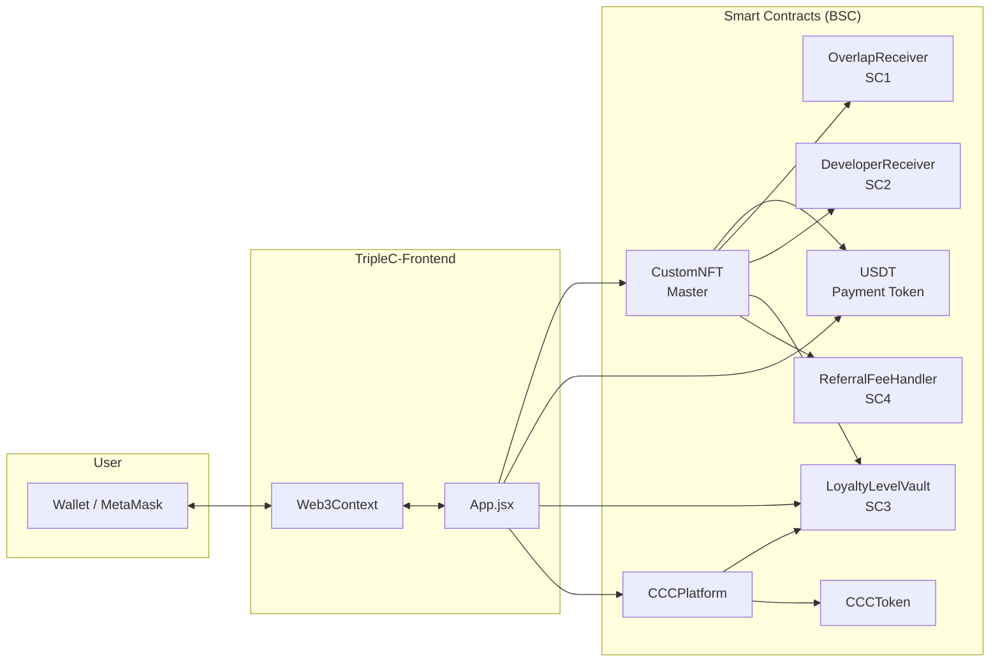
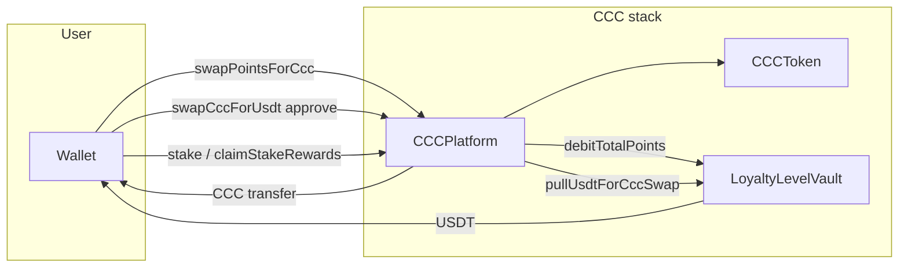
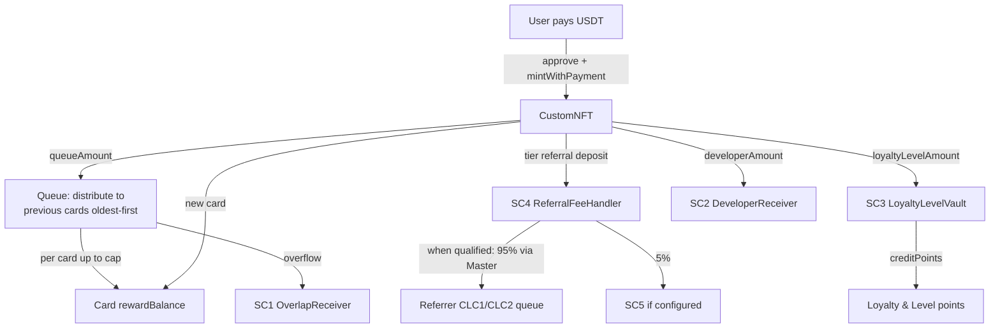
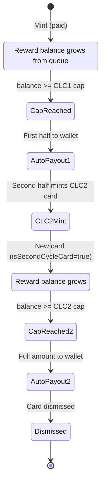
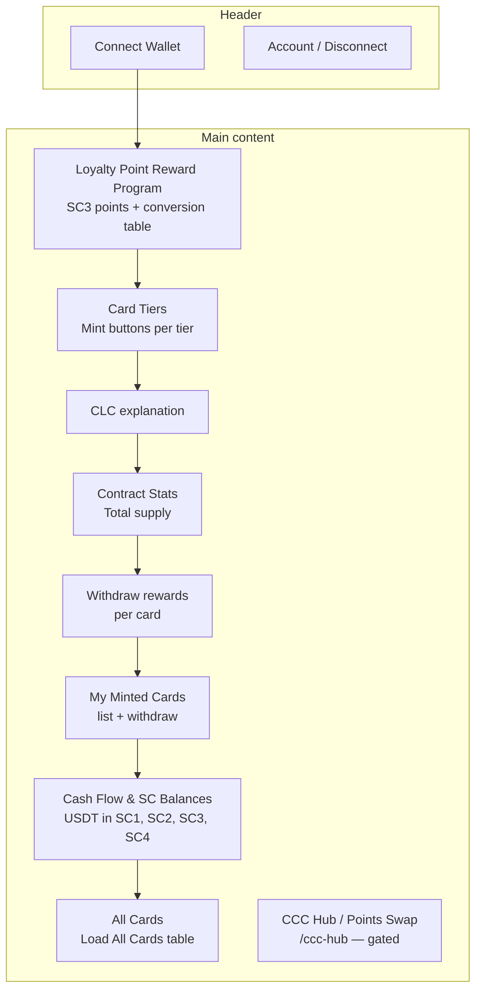

# Triple C — System & Cash Flow Diagram

Render the Mermaid diagrams below in GitHub, VS Code (Markdown Preview Mermaid), or [mermaid.live](https://mermaid.live).

---

## High-level architecture

```mermaid
flowchart LR
  subgraph User
    Wallet[Wallet / MetaMask]
  end
  subgraph Frontend["TripleC-Frontend"]
    App[App.jsx]
    Web3[Web3Context]
  end
  subgraph Contracts["Smart Contracts (BSC)"]
    Master[CustomNFT\nMaster]
    SC1[OverlapReceiver\nSC1]
    SC2[DeveloperReceiver\nSC2]
    SC3[LoyaltyLevelVault\nSC3]
    SC4[ReferralFeeHandler\nSC4]
    Plat[CCCPlatform]
    CCC[CCCToken]
    USDT[USDT\nPayment Token]
  end
  Wallet <--> Web3
  Web3 <--> App
  App --> Master
  App --> USDT
  App --> SC3
  Master --> USDT
  Master --> SC1
  Master --> SC2
  Master --> SC3
  Master --> SC4
  App --> Plat
  Plat --> SC3
  Plat --> CCC
```

---

## CCC Hub (CCCToken + CCCPlatform + SC3)

```mermaid
flowchart LR
  subgraph User
    Wallet[Wallet]
  end
  subgraph CCC["CCC stack"]
    Plat[CCCPlatform]
    Tok[CCCToken]
    SC3[LoyaltyLevelVault]
  end
  Wallet -->|swapPointsForCcc| Plat
  Plat -->|debitTotalPoints| SC3
  Plat -->|CCC transfer| Wallet
  Wallet -->|swapCccForUsdt approve| Plat
  Plat -->|pullUsdtForCccSwap| SC3
  SC3 -->|USDT| Wallet
  Plat --> Tok
  Wallet -->|stake / claimStakeRewards| Plat
```

---

## Cash flow on mint (paid mint)

```mermaid
flowchart TB
  User[User pays USDT]
  User -->|approve + mintWithPayment| Master[CustomNFT]
  Master -->|queueAmount| Queue[Queue: distribute to\nprevious cards oldest-first]
  Queue -->|per card up to cap| Card[Card rewardBalance]
  Queue -->|overflow| SC1[SC1 OverlapReceiver]
  Master -->|tier referral deposit| SC4[SC4 ReferralFeeHandler]
  SC4 -->|when qualified: 95% via Master| ReferrerQueue[Referrer CLC1/CLC2 queue]
  SC4 -->|5%| SC5Hint[SC5 if configured]
  Master -->|loyaltyLevelAmount| SC3[SC3 LoyaltyLevelVault]
  SC3 -->|creditPoints| Points[Loyalty & Level points]
  Master -->|developerAmount| SC2[SC2 DeveloperReceiver]
  Master -->|new card| Card
```

---

## Card life cycle (CLC)

```mermaid
stateDiagram-v2
  [*] --> CLC1: Mint (paid)
  CLC1: Reward balance grows from queue
  CLC1 --> CapReached: balance >= CLC1 cap
  CapReached --> AutoPayout1: First half to wallet
  AutoPayout1 --> CLC2Mint: Second half mints CLC2 card
  CLC2Mint --> CLC2: New card (isSecondCycleCard=true)
  CLC2: Reward balance grows
  CLC2 --> CapReached2: balance >= CLC2 cap
  CapReached2 --> AutoPayout2: Full amount to wallet
  AutoPayout2 --> Dismissed: Card dismissed
  Dismissed --> [*]
```

---

## Frontend sections (what the UI does)

```mermaid
flowchart TB
  subgraph Header
    Connect[Connect Wallet]
    Account[Account / Disconnect]
  end
  subgraph Main["Main content"]
    Loyalty[Loyalty Point Reward Program\nSC3 points + conversion table]
    Tiers[Card Tiers\nMint buttons per tier]
    CLC[CLC explanation]
    Stats[Contract Stats\nTotal supply]
    Withdraw[Withdraw rewards\nper card]
    MyCards[My Minted Cards\nlist + withdraw]
    CashFlow[Cash Flow & SC Balances\nUSDT in SC1, SC2, SC3, SC4]
    AllCards[All Cards\nLoad All Cards table]
    CccHub[CCC Hub / Points Swap\n/ccc-hub — gated]
  end
  Connect --> Loyalty
  Loyalty --> Tiers
  Tiers --> CLC
  CLC --> Stats
  Stats --> Withdraw
  Withdraw --> MyCards
  MyCards --> CashFlow
  CashFlow --> AllCards
```

---

## Contract roles (one-liner)

| Contract | Role |
|----------|------|
| **CustomNFT** | Mint cards; split USDT to queue/SC1–SC4; distribute to previous cards; CLC auto-payout and CLC2 auto-mint. |
| **SC1 OverlapReceiver** | Hold queue overflow USDT; owner withdraws. |
| **SC2 DeveloperReceiver** | Hold developer share USDT; owner withdraws. |
| **SC3 LoyaltyLevelVault** | Hold loyalty/level USDT; Master credits points per user. |
| **SC4 ReferralFeeHandler** | Receive full tier cashback deposit on mint; on payout send **5%** to SC5 and **95%** to Master for referrer queue accrual (or retain in SC4 if no referrer/card); owner withdraws retained USDT. |
| **CCCToken** | ERC20 (6 decimals): user-held CCC used for swaps and stakes. |
| **CCCPlatform** | Points→CCC (SC3 debit); CCC→USDT (pull USDT from SC3); **`stake`** + **`claimStakeRewards`** (**no unstake** in current hub). Details: [CCC_HUB_SPEC.md](CCC_HUB_SPEC.md). |

